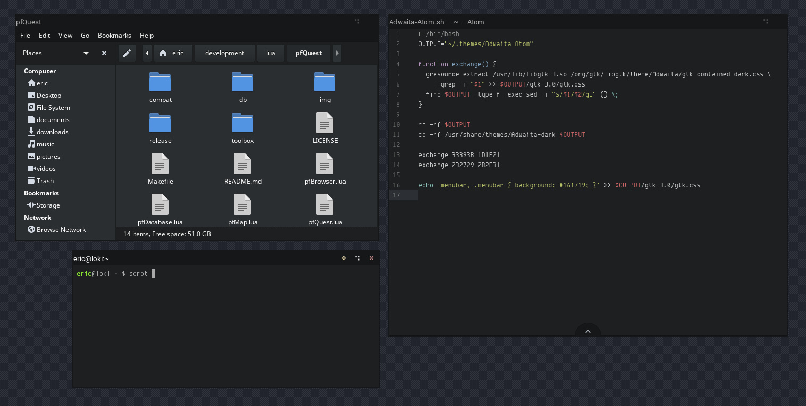

# Arkham GTK Theme

Arkham ([?](https://en.wikipedia.org/wiki/Arkham)), formerly known as adwaita-atom, is another dark theme for GTK3 and GTK2. It's directly generated out of the [Adwaita](https://github.com/GNOME/gtk/tree/master/gtk/theme/Adwaita) gresources that are shipped with GTK to provide an easily maintainable theme that always works for the latest GTK versions. Basically it's a darker variant of Adwaita with a black menubar. The dark gradients are similar to the ones that are used in the [Base16 Tomorrow Dark](https://github.com/atom/base16-tomorrow-dark-theme) [Atom](https://atom.io/) theme.

## Screenshots

*(Awesome-WM with Atom, Caja and Mate-Terminal)*

*(Mate-Desktop with Atom, Caja and Eye-of-Mate)*
